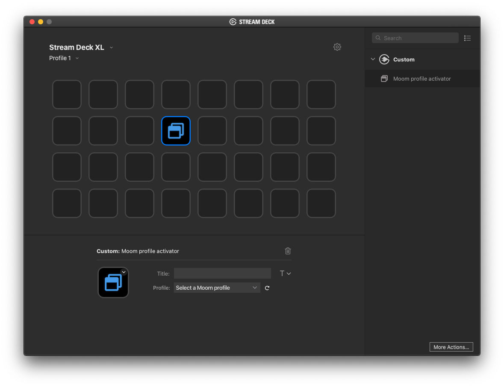

# Moom profile activator plugin for Stream Deck

This Stream Deck plugin will let you activate a [Moom](https://manytricks.com/moom/) profile of your choice.

It's made for *macOS* only.

# Prerequisities

You need [Moom](https://manytricks.com/moom/) installed on your Mac.
Moom is an amazing windows manager by Many Tricks that lets you move and zoom a window with ease. You can also create profile of several windows and activate them through a context menu or a shortcut. With this plugin you can activate them with your Stream Deck too.

# Features

The plugin will present you a list of all Moom profiles defined in your Moom installation and let you select one of your choice to activate when you press the Stream Deck button.

# How to install

1. Download the latest release from the [releases](https://github.com/magobaol/streamdeck-moom/releases) page.
2. Double click the `com.magobaol.moom.streamDeckPlugin` to install.

# Credits

- Implementation is based on the template [streamdeck-template-swift](https://github.com/JarnoLeConte/streamdeck-template-swift) by [Jarno Le Conté](https://github.com/JarnoLeConte).
- AppleScript interface based on [Finder Tags plugin for Stream Deck](https://github.com/JarnoLeConte/streamdeck-findertags) by [Jarno Le Conté](https://github.com/JarnoLeConte)
- Icons by [Font Awesome](https://fontawesome.com/license)

# Disclaimer

Moom profile activator plugin for Stream Deck *is not* a product of Many Tricks.
I developed it independently, but do have Many Tricks' permission to use Moom in my plug-in's name, and to release this plug-in. Please do not contact Many Tricks regarding any issues with the plug-in, as they won't be able to help you.
